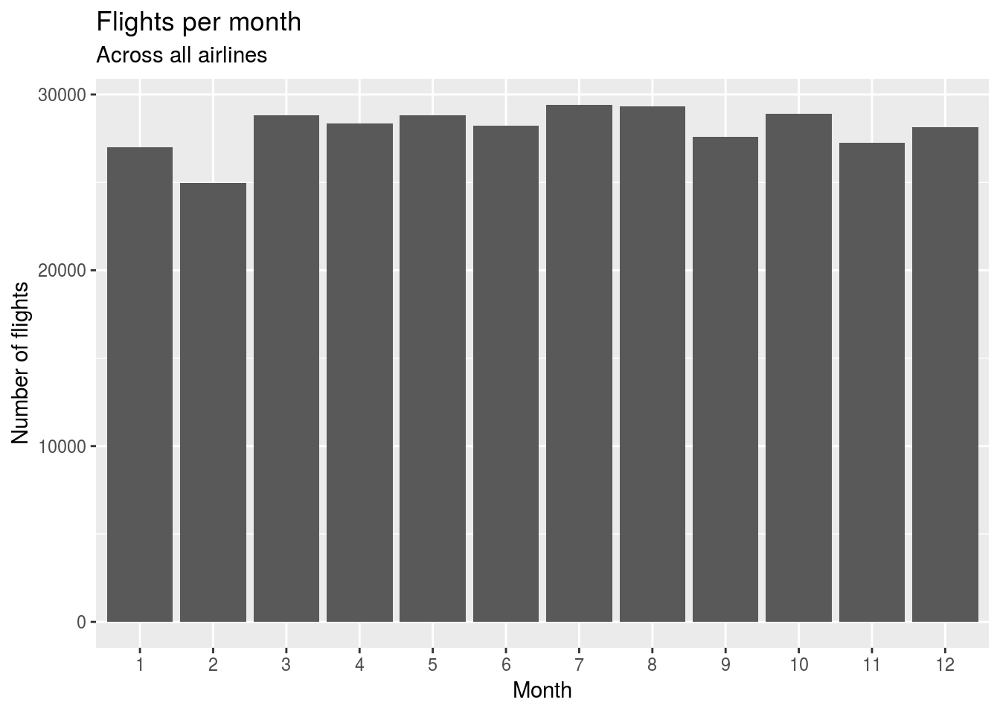

# R Markdown

This is an R Markdown document. Markdown is a simple formatting syntax for authoring HTML, PDF, and MS Word documents. For more details on using R Markdown see <http://rmarkdown.rstudio.com>.

- Bullet

- points

1. One

2. Two

3. Three

When you click the **Knit** button a document will be generated that includes both content as well as the output of any embedded R code chunks within the document. You can embed an R code chunk like this:


```r
flights_per_month %>% 
  ggplot(aes(x = factor(month), y = n)) +
  geom_col() +
  labs(
    x = "Month",
    y = "Number of flights",
    title = "Flights per month",
    subtitle = "Across all airlines"
  )
```



## Including Plots


You can also embed plots, for example:


Note that the `echo = FALSE` parameter was added to the code chunk to prevent printing of the R code that generated the plot.

$$\sqrt{\sum_1^5{x_i}}$$


```r
table1 %>% 
  knitr::kable()
```


country        year    cases   population
------------  -----  -------  -----------
Afghanistan    1999      745     19987071
Afghanistan    2000     2666     20595360
Brazil         1999    37737    172006362
Brazil         2000    80488    174504898
China          1999   212258   1272915272
China          2000   213766   1280428583


```r
table1 %>% 
  DT::datatable()
```

<!--html_preserve--><div id="htmlwidget-c29d6e03e021caca5248" style="width:100%;height:auto;" class="datatables html-widget"></div>
<script type="application/json" data-for="htmlwidget-c29d6e03e021caca5248">{"x":{"filter":"none","data":[["1","2","3","4","5","6"],["Afghanistan","Afghanistan","Brazil","Brazil","China","China"],[1999,2000,1999,2000,1999,2000],[745,2666,37737,80488,212258,213766],[19987071,20595360,172006362,174504898,1272915272,1280428583]],"container":"<table class=\"display\">\n  <thead>\n    <tr>\n      <th> <\/th>\n      <th>country<\/th>\n      <th>year<\/th>\n      <th>cases<\/th>\n      <th>population<\/th>\n    <\/tr>\n  <\/thead>\n<\/table>","options":{"columnDefs":[{"className":"dt-right","targets":[2,3,4]},{"orderable":false,"targets":0}],"order":[],"autoWidth":false,"orderClasses":false}},"evals":[],"jsHooks":[]}</script><!--/html_preserve-->
